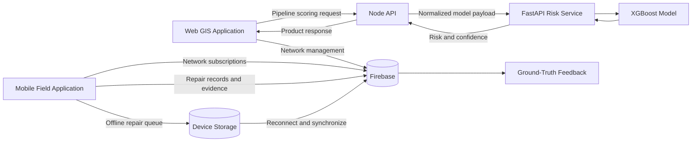

# PipeIQ

PipeIQ is a water infrastructure decision-support product that combines a web-based geographic information system, a mobile field application, and a machine-learning risk service. It is designed to help water utility teams maintain a shared view of their distribution network, prioritize pipeline inspections and repairs, and capture field outcomes that can support future model improvement.

This repository is a public-safe project distribution. It includes the application source code and bundled risk model, but does not contain Firebase credentials, service-account keys, production data, or private environment files.

## Product Context

Water distribution teams often manage network geometry, asset records, repair evidence, and condition assessments across separate tools. That fragmentation makes it difficult to answer operational questions such as:

- Which pipelines should be inspected first?
- Which zones contain the highest concentration of risk?
- What assets and pipelines exist within a service area?
- What happened in the field after a prediction was generated?
- Can repair activity continue when field connectivity is unreliable?

PipeIQ brings these workflows into one product surface. The system does not replace engineering judgement. It provides structured network information and model-assisted prioritization so operational teams can make better-informed decisions.

## Product Vision

Provide water utility teams with a dependable operational view of network condition, field activity, and emerging risk, while establishing the data feedback loop required to improve future maintenance planning.

## Intended Users and Stakeholders

| Stakeholder | Primary need | Product response |
| --- | --- | --- |
| Network planners | Understand system condition and prioritize work | GIS network map, risk layers, filters, and dashboards |
| Operations managers | Monitor pipelines, zones, assets, and repair activity | Shared operational records and summary views |
| Field technicians | Record repair evidence at the point of work | GPS-assisted mobile repair workflow with image support |
| Data and engineering teams | Evaluate model behaviour against real outcomes | Prediction snapshots and ground-truth feedback records |
| Department leadership | Improve traceability and planning confidence | Consistent data model and visible risk prioritization |

## Current Product Capabilities

### Web GIS workspace

- Interactive map with street, light, and satellite basemaps
- Pipeline, zone, and asset layer visibility controls
- Drawing, editing, repositioning, and deletion workflows
- Pipeline risk and confidence filtering
- Device location and manual coordinate navigation
- Operational dashboards for pipelines, zones, and assets
- Guided onboarding for major map controls

### Risk decision support

- Pipeline failure-risk scoring through a bundled XGBoost model
- Risk probability, confidence score, and Low, Medium, or High bands
- Stable Node API contract between the product and Python model service
- Health and readiness endpoints for deployment monitoring
- Retry, timeout, circuit-breaker, and cold-start handling
- Local browser queue when the scoring service is temporarily unavailable

### Mobile field operations

- Mobile map for pipelines, zones, and assets
- GPS-assisted pipeline discovery and manual coordinate entry
- Nearby pipeline matching and searchable pipeline selection
- Repair type, severity, flow, depth, notes, and image evidence
- Offline repair queue using local device storage
- Automatic synchronization after connectivity returns
- Duplicate-resistant repair updates

### Model feedback foundation

- Repair records linked to the selected pipeline
- Snapshot of the prediction that existed when the repair was recorded
- Ground-truth feedback collection for later model evaluation
- Utility views for inspecting and exporting collected feedback

The feedback module collects evidence for future model evaluation. It does not automatically retrain or replace the deployed model.

## Product Scope and Boundaries

The current release is an operational proof of concept focused on five product outcomes:

1. Establish a shared geographic view of pipelines, zones, and assets.
2. Support consistent creation and maintenance of infrastructure records.
3. Introduce risk-based pipeline prioritization without removing human review.
4. Enable repair capture in field conditions, including temporary loss of connectivity.
5. Collect prediction and repair evidence for future model evaluation.

The current scope does not include work-order assignment, billing, hydraulic simulation, automatic maintenance scheduling, automatic model deployment, or full enterprise identity management.

## Product Success Measures

The following measurement framework can be used for a pilot deployment. Targets should be agreed with operational stakeholders before rollout.

| Outcome | Example measure |
| --- | --- |
| Network visibility | Percentage of active pipelines, zones, and assets represented with complete required attributes |
| Planning efficiency | Time required to identify and review high-risk pipelines compared with the existing process |
| Field adoption | Percentage of eligible repairs recorded through the mobile workflow |
| Data reliability | Successful repair synchronization rate and duplicate-record rate |
| Decision traceability | Percentage of repair records linked to both a pipeline and its prior prediction context |
| Service reliability | Backend readiness, prediction success rate, and queue recovery time |
| Model evaluation readiness | Number and coverage of verified feedback records available for analysis |

## Product Architecture



### Architectural responsibilities

| Component | Responsibility | Key technologies |
| --- | --- | --- |
| `web/` | GIS workspace, CRUD workflows, dashboards, prediction queue, and feedback views | Next.js, React, TypeScript, Leaflet |
| `mobile/` | Field map, GPS workflows, repair capture, evidence, and offline synchronization | Expo, React Native, TypeScript |
| `backend/` | Public API contract, model orchestration, request normalization, resilience, and health reporting | Node.js, Express |
| `backend/risk_api/` | Feature preparation, model loading, inference, and score banding | FastAPI, scikit-learn, XGBoost |
| Firebase | Shared operational data, live subscriptions, repair evidence, and feedback records | Firestore, Storage, Admin SDK |

## Core Product Workflows

### Pipeline planning and risk assessment

1. A user draws a pipeline and enters its operational attributes.
2. The web application submits a scoring request to the Node backend.
3. The backend maps product fields to the model input schema.
4. The FastAPI service runs the bundled model.
5. Risk and confidence results return to the web application.
6. The completed pipeline and prediction are persisted in Firebase.
7. The map and dashboards update using the resulting risk band.

If the model service is unavailable, the pipeline remains in a bounded browser queue and is retried later rather than being silently discarded.

### Mobile repair capture

1. A field user obtains device coordinates or enters coordinates manually.
2. The application identifies nearby pipelines and supports full-network search.
3. The user selects the affected pipeline and records repair details.
4. Images are uploaded when connectivity is available.
5. The pipeline repair count, history, depth, and latest repair information are updated transactionally.
6. A ground-truth record stores the repair outcome and the prediction snapshot available at that time.

When offline, the repair is stored locally and replayed after connectivity returns.

## Product and Architecture Decisions

### Separate product API from model API

The web application communicates with a Node service rather than calling Python directly. This keeps the frontend contract stable while allowing the prediction implementation to evolve independently.

### Managed shared data platform

Firebase provides a common operational data source for the web and mobile products, including live updates and image storage. This reduces infrastructure overhead for the proof of concept while keeping the product focused on network workflows.

### Offline-first repair capture

Field connectivity cannot be assumed. Repair records are therefore queued on the device and synchronized later. This decision protects the primary field workflow from network availability.

### Prediction continuity without fabricated results

The web application queues scoring work during backend interruption. It does not create a fallback prediction because an invented score would undermine operational trust.

### Feedback before automated retraining

The current product captures prediction and repair evidence before introducing automatic model replacement. This supports controlled evaluation, governance, and human review of candidate models.

## Repository Structure

```text
pipeiq-submission-public/
|-- backend/
|   |-- src/server.js              Node API and model orchestration
|   |-- risk_api/                  Python inference service
|   |-- requirements.txt           Python dependencies
|   `-- Dockerfile                 Container deployment definition
|-- web/
|   |-- src/app/                   Routes, dashboards, and API routes
|   |-- src/components/map/        GIS map, dock, controls, and forms
|   `-- src/lib/                   Firebase, API, and queue services
|-- mobile/
|   |-- app/                       Expo Router screens
|   |-- lib/firebase.ts            Mobile data and repair transactions
|   |-- lib/repairQueue.ts         Offline device queue
|   `-- lib/repairSync.ts          Reconnection synchronization
`-- README.md
```

## Prerequisites

- Node.js 20 or later
- npm 10 or later
- Python 3.11 or 3.12
- A Firebase project with Firestore and Storage enabled
- Expo Go or an Expo development build for mobile testing
- Docker, only if using the containerized backend workflow

## Local Setup

Clone the public repository:

```bash
git clone https://github.com/Sahan-Gunawardhana/pipeiq-submission-public.git
cd pipeiq-submission-public
```

### 1. Configure Firebase

Create the web environment file:

```bash
cd web
cp .env.example .env.local
```

Complete the Firebase web configuration in `web/.env.local`.

For server-side Firebase access, choose one approach:

1. Set `FIREBASE_PROJECT_ID`, `FIREBASE_CLIENT_EMAIL`, and `FIREBASE_PRIVATE_KEY` in `web/.env.local`.
2. Copy `web/firebase-admin-sdk.example.json` to `web/firebase-admin-sdk.json` and populate it with a Firebase service-account JSON.

Create the mobile environment file:

```bash
cd ../mobile
cp .env.example .env
```

Complete the `EXPO_PUBLIC_FIREBASE_*` values in `mobile/.env`.

Never commit `.env`, `.env.local`, or a populated Firebase service-account file.

Return to the repository root before starting each application in the following sections.

### 2. Start the backend and model service

From the repository root:

```bash
cd backend
python3 -m venv .venv
source .venv/bin/activate
python -m pip install --upgrade pip
pip install -r requirements.txt
npm install
npm run dev
```

The Node backend automatically starts the bundled FastAPI risk service when `RISK_API_BASE` points to localhost.

Backend endpoints:

| Method | Path | Purpose |
| --- | --- | --- |
| `GET` | `/health` | Backend liveness and model-service status |
| `GET` | `/ready` | Readiness check; returns `503` when the model is unavailable |
| `POST` | `/api/score-pipeline` | Product-facing pipeline scoring endpoint |

Default backend address: `http://localhost:4000`

Verify the service:

```bash
curl http://localhost:4000/health
curl http://localhost:4000/ready
```

Example scoring request:

```bash
curl -X POST http://localhost:4000/api/score-pipeline \
  -H "Content-Type: application/json" \
  -d '{
    "pipelineId": "PIPE-001",
    "dma_id": "42_72_01",
    "install_year": 2010,
    "material": "PVC",
    "diameter_mm": 160,
    "pipe_length_m": 176.86,
    "road_category": "Main Road (A26)",
    "elevation_m": 562.6,
    "pressure_bar": 4.2,
    "n_past_repairs": 0,
    "soil_type": "Red-Yellow Podzolic Soil",
    "depth_m": 0.5
  }'
```

### 3. Start the web application

In a second terminal:

```bash
cd web
npm install
npm run dev
```

Open `http://localhost:3000`.

`NEXT_PUBLIC_BACKEND_API_BASE` should point to `http://localhost:4000` for local development.

### 4. Start the mobile application

In a third terminal:

```bash
cd mobile
npm install
npx expo start
```

Open the project with Expo Go or an installed development build. The mobile device must be able to reach Firebase and the Expo development server.

## Docker Backend

Build from the repository root:

```bash
docker build -t pipeiq-backend ./backend
```

Run the container:

```bash
docker run --rm \
  -p 4000:4000 \
  -e CORS_ORIGINS=http://localhost:3000 \
  pipeiq-backend
```

The container packages the Node API, Python runtime, dependencies, and model artifacts as one deployable backend service.

## Environment and Operational Configuration

### Web variables

| Variable | Purpose |
| --- | --- |
| `NEXT_PUBLIC_FIREBASE_*` | Firebase client connection |
| `NEXT_PUBLIC_BACKEND_API_BASE` | Node backend base URL |
| `FIREBASE_PROJECT_ID` | Server-side Firebase project |
| `FIREBASE_CLIENT_EMAIL` | Firebase Admin service account |
| `FIREBASE_PRIVATE_KEY` | Firebase Admin private key |

### Backend variables

| Variable | Default | Purpose |
| --- | --- | --- |
| `PORT` | `4000` | Public backend port |
| `CORS_ORIGINS` | `*` | Comma-separated allowed web origins |
| `RISK_API_BASE` | `http://127.0.0.1:8000` | Python model-service URL |
| `RISK_API_PYTHON` | `python3` | Python executable used for auto-start |
| `AUTO_START_RISK_API` | `true` | Controls bundled model-service startup |
| `RISK_API_TIMEOUT_MS` | `12000` | Prediction request timeout |
| `RISK_API_COLD_IDLE_MS` | `1800000` | Idle period used to detect a cold request |
| `RISK_API_STARTUP_WAIT_MS` | `120000` | Maximum cold-start wait |

## Deployment Model

The product can be deployed as four independently managed surfaces:

| Surface | Recommended role |
| --- | --- |
| Vercel | Next.js web application |
| Docker-compatible service such as Render | Node backend and bundled Python risk API |
| Firebase | Firestore, Storage, and configured access control |
| Expo/EAS or native distribution | Mobile field application |

For a deployed web application, set `NEXT_PUBLIC_BACKEND_API_BASE` to the public backend URL and configure `CORS_ORIGINS` with the exact production and preview origins that should be accepted.

## Security and Governance Considerations

- Public Firebase client configuration identifies a project but does not replace Firestore and Storage security rules.
- Firebase Admin credentials must remain server-side and must never use a `NEXT_PUBLIC_` or `EXPO_PUBLIC_` prefix.
- Departmental deployments should enforce authenticated access and role-based authorization before production use.
- CORS limits browser origins; it is not an authentication control and does not prevent direct API clients.
- Model outputs should support, not replace, engineering review and operational accountability.
- Ground-truth records should follow organizational retention, privacy, and data-quality policies.

## Non-Functional Product Goals

| Quality | Current design response |
| --- | --- |
| Availability | Health checks, readiness checks, retries, cold-start waiting, and bounded queues |
| Field resilience | Offline mobile repair capture and reconnect synchronization |
| Usability | Shared visual language, guided map tour, risk colours, filters, and location support |
| Data integrity | Firestore transactions, duplicate repair checks, validation, and normalized records |
| Maintainability | Separation between web, mobile, product API, and model service |
| Portability | Environment-based configuration and Docker backend packaging |
| Traceability | Repair history and prediction snapshots stored with feedback records |

## Product Development Learning Outcomes

This project demonstrates product-management and product-ownership work beyond implementation:

1. **Problem framing:** translating fragmented infrastructure and field workflows into a coherent decision-support product.
2. **Stakeholder analysis:** separating the needs of planners, managers, field technicians, data teams, and departmental leadership.
3. **Scope management:** defining a practical proof of concept across GIS, mobile operations, and predictive risk without claiming automated operational decisions.
4. **Workflow design:** connecting planning, prediction, field repair, and feedback into an end-to-end product journey.
5. **Architecture trade-offs:** balancing speed of delivery, managed services, deployment cost, maintainability, and model independence.
6. **Resilience planning:** treating connectivity loss and model cold starts as product requirements rather than isolated technical failures.
7. **Data-product thinking:** capturing verified outcomes and prediction context so future model performance can be evaluated responsibly.
8. **Trust and explainability:** exposing risk bands, confidence, model status, and failure states instead of hiding uncertainty.
9. **Iterative delivery:** evolving map controls, field pipeline selection, coordinate handling, offline repair capture, and operational dashboards through repeated feedback.
10. **Product governance:** identifying authentication, authorization, data quality, model review, and auditability as prerequisites for departmental rollout.

## Product Roadmap

Potential next increments are organized by product outcome rather than implementation layer:

### Operational readiness

- Department-managed identity and role-based permissions
- Formal Firestore and Storage security rules
- Audit reporting for infrastructure and repair changes
- Service monitoring, alerting, and recovery objectives

### Decision quality

- Historical prediction views by pipeline
- Model performance reporting against verified repairs
- Candidate-model comparison with approval gates
- Data-quality indicators for incomplete network records

### Field effectiveness

- Background synchronization policies
- Repair assignment and work-order status
- Evidence review and supervisor approval
- Native distribution and managed device support

### Portfolio planning

- Zone-level intervention planning
- Budget and maintenance scenario comparison
- Prioritized inspection programmes
- Export and integration contracts for departmental systems

## Current Limitations

- This repository is a proof of concept and has not been certified for production water-utility operations.
- Prediction quality depends on the relevance and quality of the training and operational data.
- Automatic retraining and automatic model replacement are intentionally outside the current scope.
- Firebase credentials and security rules must be supplied by the deploying organization.
- A production rollout requires formal access control, monitoring, backups, governance, and user acceptance testing.

## Responsible Use

PipeIQ provides risk-based decision support. A high or low score is not proof that a pipeline will or will not fail. Maintenance and safety decisions should combine model output with engineering inspection, operational history, local conditions, and accountable human review.
